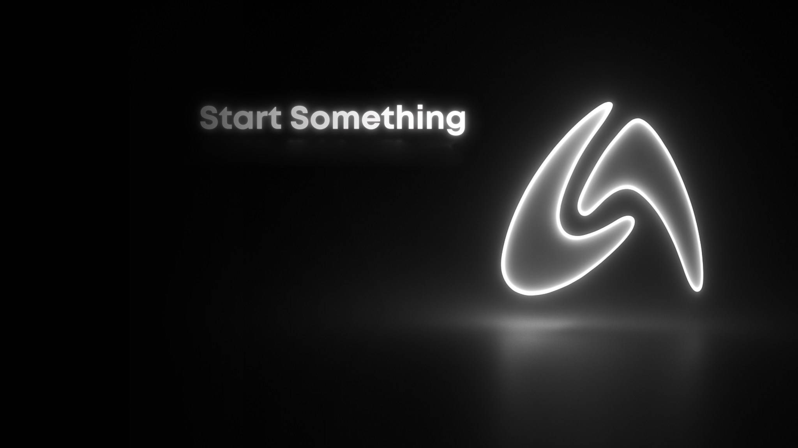

<!-- AUTOBIT Company Logo -->

  

<!-- Animated Name & Title -->

---

## 👤 About Me

I'm **Dominador C. Lillo Jr. (Domz)** — **Founder & CEO** of **AutoBIT**, a fast-moving deep-tech startup at the frontier of **Robotics**, **Machine Learning**, and **Decentralized AI Infrastructure**.

I lead a passionate team of engineers building intelligent systems that don't just automate — they **detect, predict, protect, and verify**. Our work spans edge hardware, AI models, blockchain-integrated data integrity, and mission-critical safety platforms designed for real-world, high-stakes environments.

---

## 🏢 AutoBIT — The Company

> *"We build intelligent systems for a safer, more truthful world."*

**AutoBIT** is a robotics and machine learning development team operating at the intersection of **edge AI**, **autonomous hardware**, and **decentralized data infrastructure**. We engineer solutions for environments where failure is not an option — power grids, mines, industrial sites, and critical infrastructure.

**Core Focus Areas:**
- 🤖 Robotics & Embedded AI Systems
- 🧠 Machine Learning & Anomaly Detection
- 🛡️ Safety & Truth Platform Development
- 🔗 Blockchain-Integrated Data Integrity (Axonis Protocol)
- 📡 Mesh Networking & Edge Computing

---

## 🔬 Flagship Products *(Patent Pending)*

### 🛰️ GRIDSONAR
**Mesh-Based Self-Healing Electrical Grid Fault Detection & AI 3D Visualization System**

GRIDSONAR is a **decentralized, modular electrical fault detection and predictive monitoring ecosystem** that redefines how power grids are monitored and maintained — especially in rural, disaster-prone, or infrastructure-limited regions.

**How it works:**
- Each electric pole is equipped with a **smart sub-meter node** (ESP32-based) measuring voltage, current, frequency, Total Harmonic Distortion (THD), and waveform deviations
- Nodes communicate via a **self-healing mesh network** (ESP-NOW / LoRa) — no SIM card or continuous internet required
- A **tiered relay architecture** (child nodes → parent validator nodes → gateway) ensures data integrity even in offline environments
- Each node is assigned a **Decentralized Identifier (DID)** via the **Axonis blockchain protocol** for cryptographic authentication and tamper-proof data recording
- An **AI engine** analyzes the data to detect anomalies, assign fault risk scores, and trigger **smart contracts** for automated fault response
- Results are rendered in a **real-time 3D Digital Twin interface** (Unity3D + TouchDesigner) — color-coded fault indicators (🟢🟡🔴) on a GPS-mapped geographic layout

**Key Innovation:** GRIDSONAR replaces expensive SCADA systems with a low-cost, decentralized, blockchain-verified grid health platform — making critical infrastructure diagnostics accessible to underserved and off-grid communities.

| Feature | Capability |
|---|---|
| 📡 Connectivity | Mesh P2P — No SIM / No Continuous Internet Required |
| 🔐 Data Integrity | Axonis Blockchain + DID Cryptographic Authentication |
| 🤖 AI Engine | Anomaly Detection · Fault Risk Scoring · Predictive Alerts |
| 🌐 Visualization | Real-Time 3D Digital Twin (GPS-mapped pole network) |
| ⚡ Smart Response | Automated Smart Contracts on Fault Threshold Breach |
| 🔄 Self-Healing | Automatic Mesh Rerouting on Node Failure |

---

### ⛏️ MineSafe AI
**AI-Powered Safety Intelligence Engine for High-Risk Mining Environments**

**MineSafe AI** is an intelligent safety monitoring engine built under AutoBIT's Safety & Truth Platform — engineered to **protect lives** in one of the world's most hazardous industries.

MineSafe AI applies machine learning and real-time sensor intelligence to deliver **proactive hazard detection**, risk prediction, and situational awareness in active mining operations — shifting safety culture from reactive to **predictive**.

| Feature | Capability |
|---|---|
| 🔍 Detection | Real-Time Hazard Identification |
| 🧠 Intelligence | ML-Driven Predictive Risk Assessment |
| 👁️ Vision | Machine Vision & Environmental Monitoring |
| 📊 Reporting | Automated Safety Incident Logging |
| 🚨 Alerting | Instant Threshold-Based Safety Alerts |

---

## 🛡️ The AutoBIT Platform: Safety & Truth

Both GRIDSONAR and MineSafe AI are core engines of **AutoBIT's unified Safety & Truth Platform** — built on two unbreakable pillars:

| 🛡️ Safety | ✅ Truth |
|---|---|
| Proactive, AI-driven hazard detection and risk mitigation for critical and dangerous environments | Transparent, verifiable, blockchain-backed data systems ensuring accountability and accuracy in autonomous decision-making |

The platform integrates **Axonis** — a distributed ledger protocol that ensures every data point from field sensors is cryptographically signed, immutably recorded, and auditable — bringing **truth** to the data powering life-critical decisions.

---

## 🧠 Tech Stack

---

## 📊 GitHub Stats

---

## 🌐 Connect

[-000000?style=for-the-badge&logo=x&logoColor=white)](https://x.com/autobit)

---

**GRIDSONAR · MineSafe AI · Axonis Protocol**
*Patent Pending · AutoBIT © 2025*

*"We don't just build robots. We build trust."*

